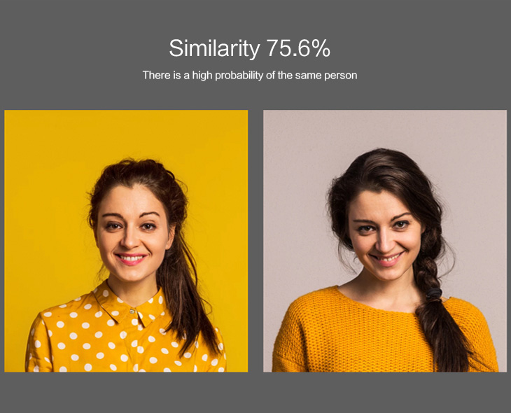

# face-verify.

Face verify is face recognition model that verify 1:1 face



### Run Docker
```
cd face-verify
docker compose -f deployment/prod/docker-compose.build.yaml build
```

start service run this script
```
cd face-verify
docker compose -f deployment/prod/docker-compose.yaml up -d
```

### RUN python
Can run on python 3.7.13

Install requirements
```
cd ai-service
pip install -r requirements.txt
```

Run API service
```
cd ai-service
python main.py
```

Noted: 
Must download models and paste models to path below.
```
face-verify\ai-service\src\provider\models\<face_detect>
face-verify\ai-service\src\provider\models\<face_embedding>
```
